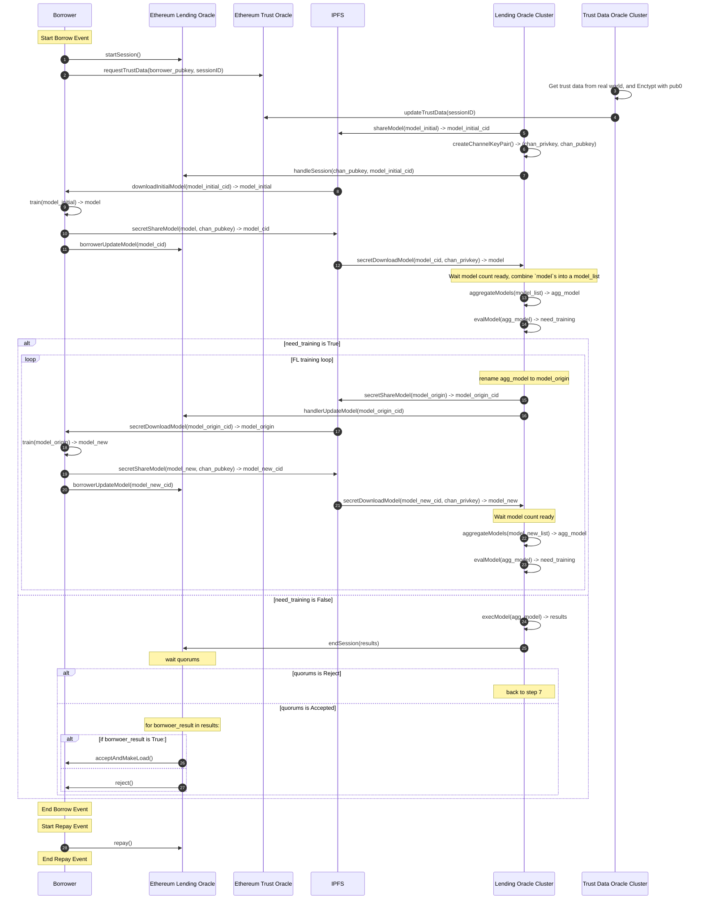

Lending Activity

```mermaid
sequenceDiagram
    autonumber
    participant b as Borrower
    participant ethl as Ethereum Lending Oracle
    participant etht as Ethereum Trust Oracle
    participant ipfs as IPFS
    participant loc as Lending Oracle Cluster
    participant toc as Trust Data Oracle Cluster

    Note over b: Start Borrow Event
    b->>ethl: startSession()

    b->>etht: requestTrustData(borrower_pubkey, sessionID)
    toc->>toc: Get trust data from real world, and Enctypt with pub0
    toc->>etht: updateTrustData(sessionID)

    loc->>ipfs: shareModel(model_initial) -> model_initial_cid
    loc->>loc: createChannelKeyPair() -> (chan_privkey, chan_pubkey)
    loc->>ethl: handleSession(chan_pubkey, model_initial_cid)

    ipfs->>b: downloadInitialModel(model_initial_cid) -> model_initial
    b->>b: train(model_initial) -> model
    b->>ipfs: secretShareModel(model, chan_pubkey) -> model_cid
    b->>ethl: borrowerUpdateModel(model_cid)
    ipfs->>loc: secretDownloadModel(model_cid, chan_privkey) -> model
  
    Note over loc: Wait model count ready, combine `model`s into a model_list 
    loc->>loc: aggregateModels(model_list) -> agg_model
    loc->>loc: evalModel(agg_model) -> need_training

    alt need_training is True
        loop FL training loop
            Note over loc: rename agg_model to model_origin
            loc->>ipfs: secretShareModel(model_origin) -> model_origin_cid
            loc->>ethl: handlerUpdateModel(model_origin_cid)
            ipfs->>b: secretDownloadModel(model_origin_cid) -> model_origin
            b->>b: train(model_origin) -> model_new
            b->>ipfs: secretShareModel(model_new, chan_pubkey) -> model_new_cid
            b->>ethl: borrowerUpdateModel(model_new_cid)
            ipfs->>loc: secretDownloadModel(model_new_cid, chan_privkey) -> model_new
            Note over loc: Wait model count ready
            loc->>loc: aggregateModels(model_new_list) -> agg_model
            loc->>loc: evalModel(agg_model) -> need_training
        end
    else need_training is False
        loc->>loc: execModel(agg_model) -> results
        loc->>ethl: endSession(results)
        Note over ethl: wait quorums
        alt quorums is Reject
            Note over loc: back to step 7
        else quorums is Accepted
            Note over ethl: for borrwoer_result in results:
            alt if borrwoer_result is True:
                ethl->>b: acceptAndMakeLoad()
            else
                ethl->>b: reject()
            end
        end
    end
    Note over b: End Borrow Event

    Note over b: Start Repay Event
    b->>ethl: repay()
    Note over b: End Repay Event
```

TODO: add installment
