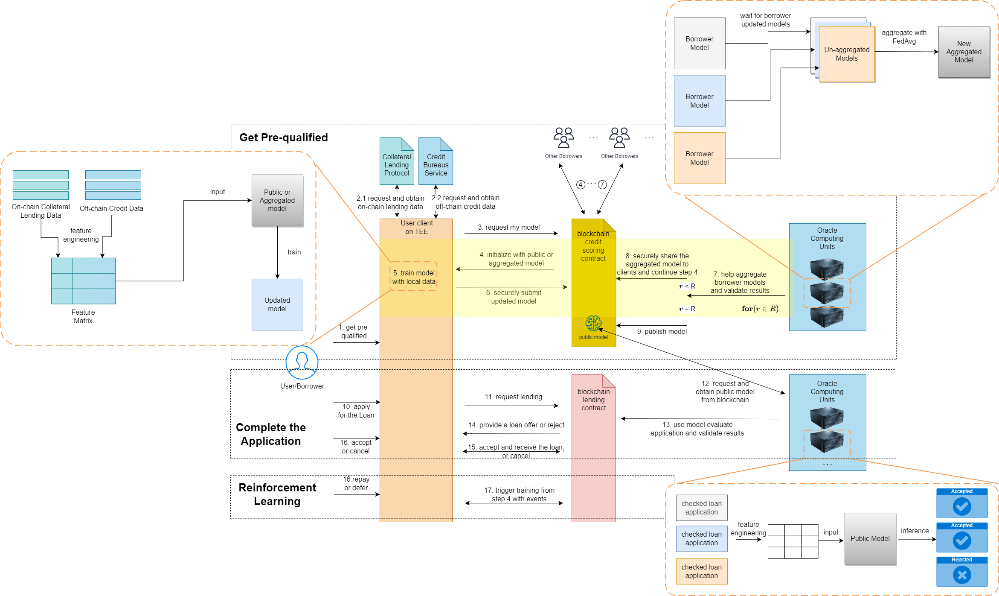

# Creditium

This is a simplified demo for research paper ["Leveraging Federated Learning for Unsecured Loan Risk Assessment on Decentralized Finance Lending Platforms"](https://ieeexplore.ieee.org/document/10411541)



## Requirements

- Docker with `docker` and `docker-compose` commands
- Python >=3.8 with `python` and `pip` commands

Install requirements:

```bash
pip install -r requirements.txt
```

You might have to install some dependencies (e.g. tensorflow) according to their official install instrucions.

## Usage

run `python simulator.py` with `--deploy` flag for the re-deployment

```
python simulator.py
```

Auto_suggest and completion have already assembled in the simulator.

Demo Steps:

```bash
>>> deploy_contracts 0x71b3D7405080197fC03cA82bCDd1764F1e14ABf2
>>> load_contracts 0x71b3D7405080197fC03cA82bCDd1764F1e14ABf2
```

```bash
>>> new_prover 0xC9c4496508E92A9FCB0Ffc8Cb6363f910C7E8AE3 p0
>>> prover_p0 listen
>>> new_lender 0x59Ef5B8b24cE3e00Ad0345cD2d47f96947c3e2c3 l0
>>> lender_l0 listen
>>> new_treasurer 0x402E6377BBed775A3B3eBC7C3DF9A21Bf61Ae49F t0
>>> treasurer_t0 listen
```

```bash
>>> 
>>> new_client 0x4B54772Cc9e233B4fe1F04A65a994aF40A6834ac c0
>>> new_client 0x4B54772Cc9e233B4fe1F04A65a994aF40A6834ac c 10
>>> all_client proving_request_and_wait
>>> all_client lending_request_and_wait
>>> all_client try_get_token_from_treasury 100000000000000000
```

## Citation

```bibtex
@INPROCEEDINGS{10411541,
  author={Mao, Qian’ang and Wan, Sheng and Hu, Daning and Yan, Jiaqi and Hu, Jin and Yang, Xuan},
  booktitle={2023 IEEE International Conference on Data Mining Workshops (ICDMW)}, 
  title={Leveraging Federated Learning for Unsecured Loan Risk Assessment on Decentralized Finance Lending Platforms}, 
  year={2023},
  volume={},
  number={},
  pages={663-670},
  abstract={This study proposes a novel privacy-preserving unsecured loan risk assessment system that allows decentralized finance (DeFi) lending platforms to offer loans without collateral. This system leverages federated learning methods to train risk assessment models using both off-chain and on-chain data sources, to more accurately evaluate borrower default risk for unsecured loans. Moreover, this system is built on a trusted execution environment (TEE) with program-level isolation, which provides a secure and efficient solution for DeFi platforms to offer unsecured loans. The effectiveness of this platform is validated through a set of simulation experiments. These experiments underscore the capability of the federated learning models to accurately assess borrower default risk while preserving stringent data privacy standards. The unique and innovative system design we proposed offers significant advancements for DeFi lending platforms. These improvements have the potential to greatly enhance DeFi platforms’ inclusiveness by offering unsecured loans while maintaining efficiency, and security.},
  keywords={Data privacy;Federated learning;Finance;Decentralized applications;Data models;Risk management;Usability;federated learning;blockchain;unsecured lending;credit scoring},
  doi={10.1109/ICDMW60847.2023.00092},
  ISSN={2375-9259},
  month={Dec},}
```
